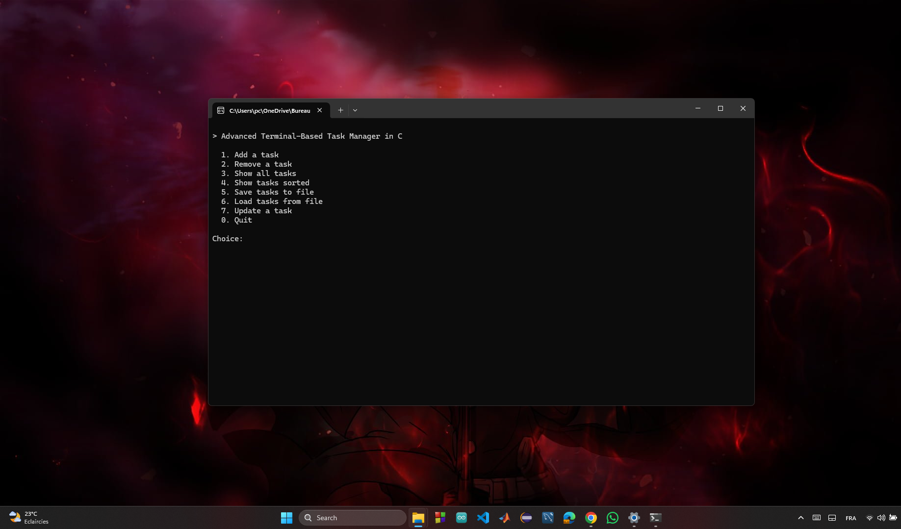

# Advanced-Terminal-Based-Task-Manager-in-C

A robust, terminal-based Task Manager application written in C, designed to manage tasks with advanced features such as task creation, deletion, updating, sorting, undo functionality, and persistent storage. The project leverages a **singly linked list** for primary task storage, a **stack** for undo operations, **binary search trees (BSTs)** for sorting, and **file I/O** for data persistence. The implementation emphasizes modularity, memory safety, and user-friendly interaction.



## Table of Contents

- Project Overview
- Features
- Design Principles
  - Modularity and Separation of Concerns
  - Data Structure Choices
  - Memory Management
  - Input Validation and User Experience
- Data Structures
  - Task
  - List (Singly Linked List)
  - Stack (Undo Functionality)
  - Tree (Binary Search Trees)
  - File I/O
  - Input Utilities
- Relationships Between Data Structures
  - Task and List
  - List and Stack
  - List and Tree
  - List and File I/O
  - Stack and Tree
- Implementation Details
  - Task Management
  - Undo Mechanism
  - Sorting with BSTs
  - File Persistence
- Installation
  - Prerequisites
  - Build Instructions
- Usage
  - Running the Program
  - Menu Navigation
  - Example Workflow
- Testing
  - Test Cases
  - Memory Leak Checks
- Contributing
- License

## Project Overview

The Task Manager is a command-line application for managing tasks, each defined by an ID, title, description, priority (High, Medium, Low), and status (Not Started, In Progress, Finished). It provides a menu-driven interface to add, remove, update, and sort tasks, with undo functionality for deletions and persistent storage in a binary file. The project is implemented in C, prioritizing modularity, efficiency, and robustness. It’s designed for Windows (using `windows.h` for features like `Sleep`) but can be adapted for other platforms.

The application is structured to demonstrate key computer science principles, including data structure design, memory management, and user input validation. It’s suitable for educational purposes, showcasing how multiple data structures (linked list, stack, BST) work together to solve a practical problem.

## Features

- **Task Management**:
  - Add tasks to the head, middle (after a specified ID), or end of the list.
  - Remove tasks from the head, end, or by ID.
  - Update task priority and status by ID.
  - Clear all tasks with a single operation.
- **Undo Functionality**:
  - Undo task deletions, restoring tasks to their original position (head, middle, or end).
  - Stack limited to 10 tasks, with automatic removal of the oldest task when full.
  - Validates task IDs during restoration to prevent conflicts.
  - Option to clear the undo stack.
  - Displays the number of available undos and the next task’s ID.
- **Sorting**:
  - Sort and display tasks by ID, priority, or status using three BSTs.
- **Persistent Storage**:
  - Save tasks to a binary file (`tasks.dat`) and load them on startup.
- **User Interface**:
  - Menu-driven interface with clear prompts and submenus.
  - Visual loading bar for operations (add, remove, update, save, load).
  - Robust input validation to handle invalid inputs gracefully.
- **Memory Safety**:
  - Careful memory allocation and deallocation to prevent leaks.
  - Error handling for allocation failures and file operations.

## Design Principles

### Modularity and Separation of Concerns

The project is divided into modular components, each responsible for a specific aspect of functionality:

- **Task Management**: `task.h` and `task.c` handle task creation and display.
- **List Operations**: `list.h` and `list.c` manage the linked list and task counter.
- **Undo Functionality**: `stack.h` and `stack.c` implement the undo stack.
- **Sorting**: `tree.h` and `tree.c` handle BST-based sorting.
- **File I/O**: `file.h` and `file.c` manage persistent storage.
- **Input Handling**: `input_utils.h` and `input_utils.c` ensure safe user input.
- **Main Program**: `main.c` orchestrates the user interface and integrates all components.

This modular design enhances maintainability, testability, and extensibility. Each module has a single responsibility, reducing coupling and making it easier to modify or extend individual components.

### Data Structure Choices

The choice of data structures is driven by the application’s requirements:

- **Singly Linked List** (`List`): Ideal for dynamic task storage with frequent insertions and deletions at the head or end. The list maintains insertion order and supports middle insertions by ID.
- **Stack** (`StackNode`): Perfect for undo functionality, as it follows a Last-In-First-Out (LIFO) model to restore the most recently deleted task. The stack stores position metadata to restore tasks accurately.
- **Binary Search Trees** (`TreeNode`): Enable efficient sorting by ID, priority, or status. BSTs provide O(log n) average-case insertion and traversal, suitable for displaying sorted tasks.
- **Binary File I/O**: Simplifies persistent storage by writing tasks directly as binary data, preserving the `Task` structure’s layout.

### Memory Management

Memory safety is a core principle:

- **Dynamic Allocation**: All tasks and nodes are dynamically allocated using `malloc` and freed with `free` to prevent leaks.
- **Ownership Rules**:
  - The `List` owns `Task` pointers until tasks are removed.
  - Removed tasks are transferred to the `Stack`, which owns them until restored or cleared.
  - `Tree` nodes reference tasks (owned by the `List` or `Stack`) to avoid double-freeing.
- **Error Handling**: Checks for allocation failures and handles them gracefully with error messages.
- **Cleanup**: The program frees all allocated memory on exit using `list_freeAll`, `stack_free`, and `tree_free`.

### Input Validation and User Experience

- **Safe Input**: Uses `input_utils.c` functions (`readInt`, `readIntInRange`, `readString`) to prevent buffer overflows and validate inputs.
- **User Feedback**: Provides clear prompts, error messages, and a loading bar for visual feedback during operations.
- **Intuitive Menu**: Organized into a main menu and submenus for adding, removing, and sorting tasks, with clear navigation options.

## Data Structures

### Task

- **File**: `task.h`, `task.c`
- **Structure**: `Task` (ID, title, description, priority, status)
- **Purpose**: Represents a single task with its attributes.
- **Key Functions**:
  - `fillTask`: Populates a task with validated user input.
  - `printTask`: Displays task details in a formatted way.
- **Design Rationale**: Uses enums for `priority` and `status` to ensure type safety and readability. Fixed-size character arrays prevent buffer overflows.

### List (Singly Linked List)

- **File**: `list.h`, `list.c`
- **Structure**: `List` (contains a `Task` pointer and `next` pointer)
- **Purpose**: Primary storage for tasks, maintaining insertion order.
- **Key Functions**:
  - `list_addToHead`, `list_addToMiddle`, `list_addToEnd`: Add tasks at different positions.
  - `list_removeFromHead`, `list_removeFromEnd`, `list_removeByID`: Remove tasks.
  - `list_updateTask`: Update priority and status of a task by ID.
  - `list_restoreTask`: Restore a deleted task from the stack.
  - `list_printAll`: Display all tasks.
  - `listCounter_*`: Manage the global task counter.
  - `loadingBar`: Visual feedback for operations.
- **Design Rationale**: A singly linked list is efficient for insertions and deletions at the head (O(1)) and end (O(n)). Middle insertions/removals require traversal but are acceptable for small lists.

### Stack (Undo Functionality)

- **File**: `stack.h`, `stack.c`
- **Structure**: `StackNode` (contains a `Task` pointer, `TaskPosition` enum, `target_id`, and `next` pointer); `Stack` (tracks the top node and size).
- **Purpose**: Stores deleted tasks for undo operations, with metadata to restore tasks to their original position.
- **Key Functions**:
  - `stack_create`, `stack_free`: Initialize and clean up the stack.
  - `stack_push`, `stack_pop`: Add/remove tasks with position metadata.
  - `stack_peek`: View the top task without removing it.
  - `stack_clear`: Clear all tasks from the stack.
  - `stack_getSize`, `stack_isEmpty`: Query stack state.
- **Design Rationale**: A stack is ideal for undo operations (LIFO). The size limit (10 tasks) prevents memory overuse, and metadata ensures accurate restoration.

### Tree (Binary Search Trees)

- **File**: `tree.h`, `tree.c`
- **Structure**: `TreeNode` (contains a `Task` pointer, left/right child pointers); `Tree` (tracks the root and sort key: ID, priority, or status).
- **Purpose**: Enables sorting tasks by ID, priority, or status using inorder traversal.
- **Key Functions**:
  - `tree_create`, `tree_free`: Initialize and clean up a BST.
  - `tree_insert`: Insert a task into the BST based on the sort key.
  - `tree_printInorder`: Display tasks in sorted order.
- **Design Rationale**: BSTs provide efficient sorting (O(log n) average-case insertion). Three trees are maintained to support multiple sort criteria without modifying the list.

### File I/O

- **File**: `file.h`, `file.c`
- **Purpose**: Saves tasks to `tasks.dat` and loads them to ensure persistence.
- **Key Functions**:
  - `file_saveTasks`: Write tasks to a binary file.
  - `file_loadTasks`: Read tasks and rebuild the list and BSTs.
- **Design Rationale**: Binary I/O simplifies serialization by writing the `Task` structure directly. The file stores the task count followed by task data for easy reconstruction.

### Input Utilities

- **File**: `input_utils.h`, `input_utils.c`
- **Purpose**: Provides safe input functions to prevent buffer overflows and validate user input.
- **Key Functions**:
  - `readInt`: Reads a valid integer.
  - `readIntInRange`: Reads an integer within a specified range.
  - `readString`: Reads a string with spaces, preventing overflows.
  - `cleanNewline`: Removes trailing newlines from input.
- **Design Rationale**: Ensures robust input handling, critical for a command-line application.

## Relationships Between Data Structures

The data structures are tightly integrated to support the application’s functionality, with clear ownership and reference rules:

### Task and List

- **Relationship**: Each `List` node owns a dynamically allocated `Task`. The linked list is the primary storage mechanism, holding all active tasks.
- **Interaction**:
  - Tasks are created and populated via `fillTask` during `list_add*` operations.
  - When a task is removed, its `Task` pointer is transferred to the stack, and the `List` node is freed.
  - `list_updateTask` modifies a task’s priority and status in place.

### List and Stack

- **Relationship**: The stack stores `Task` pointers from removed tasks, taking ownership until they are restored or cleared.
- **Interaction**:
  - Removal functions (`list_remove*`) push tasks to the stack with metadata (`TaskPosition`, `target_id`).
  - `list_restoreTask` pops a task, checks for ID conflicts, and reinserts it into the list, transferring ownership back.
  - The stack’s size limit (10) ensures memory efficiency.

### List and Tree

- **Relationship**: The `List` owns tasks, while `Tree` nodes reference these tasks for sorting. Three BSTs (`id_tree`, `priority_tree`, `status_tree`) maintain sorted views.
- **Interaction**:
  - Adding a task (`list_add*`) inserts it into all three BSTs.
  - Updating a task (`list_updateTask`) rebuilds `priority_tree` and `status_tree` to reflect changes.
  - `Tree` nodes do not own tasks, preventing double-freeing when the list is cleared.

### List and File I/O

- **Relationship**: The `List` provides tasks for saving to `tasks.dat` and is reconstructed when loading.
- **Interaction**:
  - `file_saveTasks` writes all tasks from the list to the file.
  - `file_loadTasks` clears the list, reads tasks, and rebuilds the list and BSTs.
  - The list owns tasks loaded from the file.

### Stack and Tree

- **Relationship**: Indirect interaction via the list. The stack does not directly reference trees.
- **Interaction**:
  - Restoring a task (`list_restoreTask`) adds it to the list and BSTs.
  - Clearing the stack (`stack_clear`) affects only tasks in the stack, not the trees.

This design ensures data consistency, with the `List` as the central structure, the `Stack` for temporary storage, and `Tree` for sorting. File I/O extends the list’s functionality to persistent storage.

## Implementation Details

### Task Management

- **Adding Tasks**: Users can add tasks at the head (`list_addToHead`), after a specific ID (`list_addToMiddle`), or at the end (`list_addToEnd`). Each operation allocates a `Task` and `List` node, populates the task, and updates the task counter and BSTs.
- **Removing Tasks**: Tasks can be removed from the head (`list_removeFromHead`), end (`list_removeFromEnd`), or by ID (`list_removeByID`). Removed tasks are pushed to the stack.
- **Updating Tasks**: `list_updateTask` allows modifying priority and status by ID, rebuilding the BSTs to maintain sorting.

### Undo Mechanism

- **Stack Operations**: The stack stores up to 10 deleted tasks, with metadata (`TaskPosition`, `target_id`) to restore tasks to their original position.
- **Restoration**: `list_restoreTask` checks for ID conflicts, prompting for a new ID if necessary, and reinserts the task into the list and BSTs.
- **Stack Management**: The stack can be cleared (`stack_clear`), and the menu displays the number of available undos and the next task’s ID.

### Sorting with BSTs

- **Three Trees**: Separate BSTs for ID, priority, and status ensure efficient sorting without modifying the list’s order.
- **Insertion**: Tasks are inserted into all trees during addition or restoration.
- **Update Handling**: Updating priority or status rebuilds the affected trees to maintain correct ordering.
- **Display**: Inorder traversal (`tree_printInorder`) displays tasks in sorted order.

### File Persistence

- **Saving**: `file_saveTasks` writes the task count and task data to `tasks.dat` in binary format.
- **Loading**: `file_loadTasks` clears the list, reads tasks, and reconstructs the list and BSTs.
- **Error Handling**: Checks for file access and allocation failures.

## Installation

### Prerequisites

- **C Compiler**: `gcc` or equivalent (e.g., MinGW on Windows).
- **Operating System**: Windows (uses `windows.h` for `Sleep` and `system("cls")`). Adaptable for Linux/macOS by replacing with `system("clear")` and `usleep`.
- **Git**: Optional, for cloning the repository.
- **Valgrind**: Optional, for memory leak testing.

### Build Instructions

1. **Clone the Repository**:

   ```bash
   git clone https://github.com/your-username/task-manager-c.git
   cd task-manager-c
   ```

2. **Compile the Program**:

   ```bash
   gcc -o task_manager main.c list.c task.c input_utils.c stack.c tree.c file.c -I.
   ```

3. **Run the Program**:

   ```bash
   ./task_manager
   ```

## Usage

### Running the Program

Execute `./task_manager` to start the application. Tasks are loaded from `tasks.dat` if available.

### Menu Navigation

- **Main Menu**:

  - 1: Add a task (submenu: head, middle, end).
  - 2: Remove a task (submenu: head, end, by ID, clear all, undo, clear stack).
  - 3: Show all tasks (insertion order).
  - 4: Show tasks sorted (submenu: by ID, priority, status).
  - 5: Save tasks to file.
  - 6: Load tasks from file.
  - 7: Update a task (priority and status by ID).
  - 0: Quit (frees all memory).

- **Input**:

  - Numeric inputs use `readInt` (e.g., task ID).
  - Priority/status inputs use `readIntInRange` (1-3).
  - Visual feedback includes a loading bar (e.g., `[..........] Done!`).

### Example Workflow

1. **Add Tasks**:

   - Select option 1, then 1 to add a task (ID: 1, Priority: HIGH, Status: NOT_STARTED) to the head.
   - Add another task (ID: 2, Priority: MEDIUM, Status: IN_PROGRESS) to the end (option 1, then 3).

2. **Update Task**:

   - Select option 7, enter ID 1, set Priority: MEDIUM, Status: IN_PROGRESS.
   - Output: `Updating task [..........] Done! Task updated successfully.`

3. **Remove and Undo**:

   - Remove task ID 2 (option 2, then 3).
   - Undo the removal (option 2, then 5); task is restored to the end.
   - Check available undos in the remove submenu (displays count and next ID).

4. **Sort Tasks**:

   - View tasks sorted by priority (option 4, then 2).
   - Confirm task ID 1 appears in the correct order.

5. **Save and Load**:

   - Save tasks (option 5).
   - Exit and restart; tasks are loaded automatically (option 6 for manual load).

## Testing

### Test Cases

- **Task Addition**: Add tasks at head, middle, and end; verify list order and task counter.
- **Task Removal**: Remove tasks from head, end, and by ID; confirm tasks are pushed to the stack.
- **Undo**: Delete tasks, undo them, and verify restoration to original positions. Test ID conflict resolution.
- **Update**: Change priority/status of a task; verify sorted output reflects changes.
- **Sorting**: Check sorted output for ID, priority, and status.
- **File I/O**: Save tasks, restart, and load to ensure data persistence.
- **Edge Cases**: Test empty list, invalid IDs, allocation failures, and full undo stack.

### Memory Leak Checks

- Use Valgrind to ensure no memory leaks:

  ```bash
  valgrind --leak-check=full ./task_manager
  ```
- Verify all allocated memory (`Task`, `List`, `StackNode`, `TreeNode`, `Stack`, `Tree`) is freed on exit.

## Contributing

Contributions are welcome to enhance the Task Manager’s functionality or performance.

## License

This project is licensed under the MIT License. See the LICENSE file for details.
